## List-Format-Parser

View the LIST's Format() string split into one line per column. Explain and Help on Modifier letters. Useful for ...

* Under Source Control it is easier to understand changes to the LIST by viewing FORMAT in Lines

* See all columns in rows to view all pictures at once, maybe change all @n9.2 to have "b"

* See all columns in rows to view or change Modifiers e.g. remove * off multiple fields for no Color

* Duplicate columns or entire groups by copying rows of format

* Invalid Format errors easier to solve with the LIST split

Paste your LIST FORMAT including #FIELDS() and press Process:

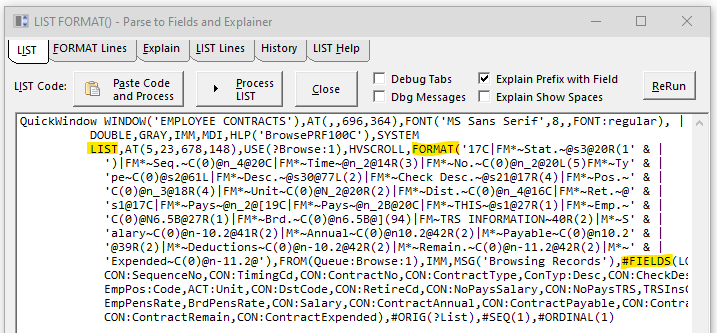

The Format and Fields are split into lines. This makes it easy to read and see columns are consistent. You can paste this into a compare tool. The parsed Format is designed to paste back into your Window... editor to allow modifications.

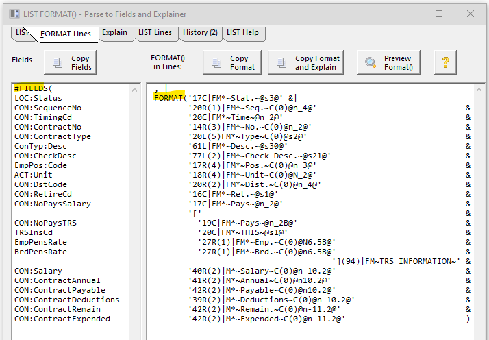

The Explain tab tries to make the Format easier to understand

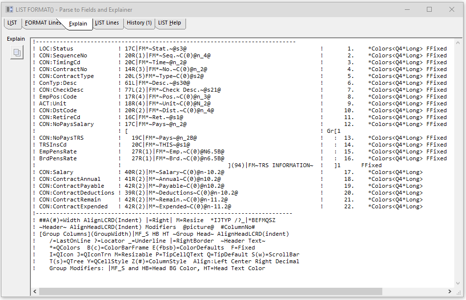

The History shows all the LISTs processed since the program opened. You can go back to any prior LIST. 

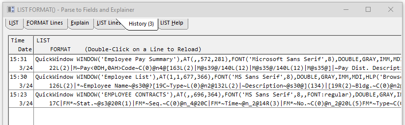

The LIST Help tab documents Modifiers and other Properties.

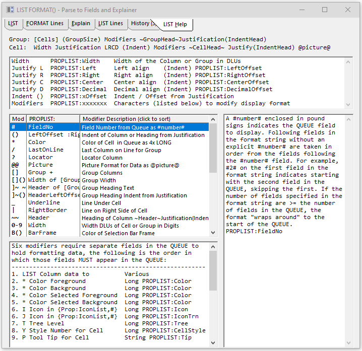

### Preview List

From the "Format Lines" tab you can click the "Preview Format" button to open a Window showing a LIST with that Format().
 Sample data lines are generated showing the maximum numbers that will fit.

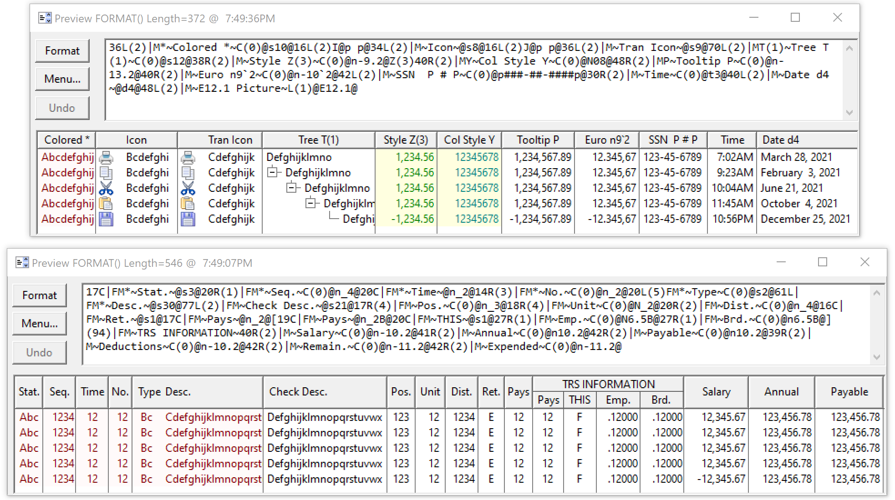

The "Format" button opens my Window Preview Class LIST view to see the Format as shown below.
 You can view all the PROPLIST's for a Column. You can Re-Format the list to view different settings.

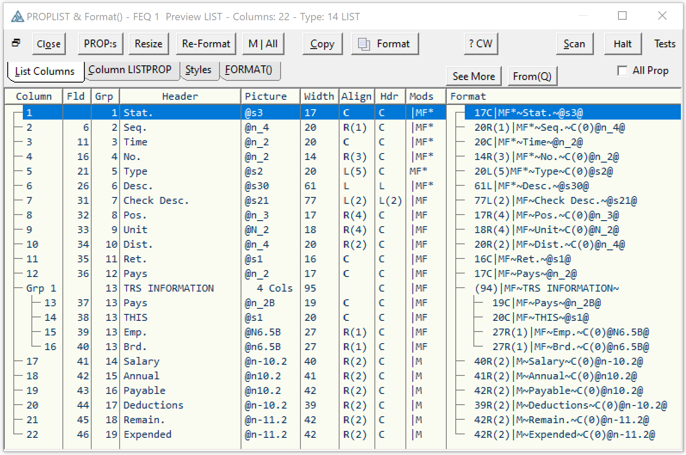

### Window ... Editor

I often paste the Format into the Window... Editor and make my changes there much faster than via the List Designer. I also can go fast and not freeze the IDE.
 In this example I wanted to make sure all pictures had commas and were large enough for -999,999.99.

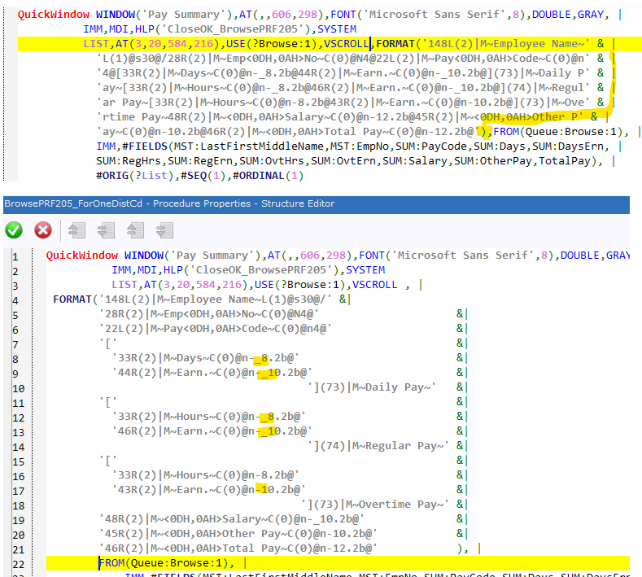

### Comparison

In Source control comparing a LIST,FORMAT() and #FIELDS() as a multiline block can make it impossible to see the changes. This picture has what are normally left and right stacked viewing the LIST control.

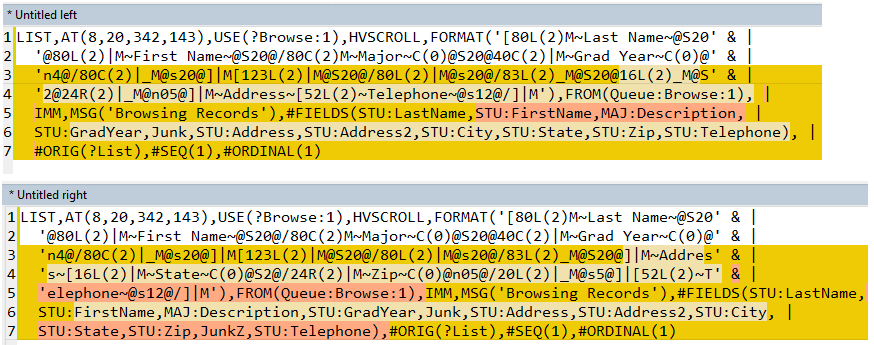

Below shows comparing the Format split into lines and it becomes more clean some columns titled Stae and Zip were added plus a new [ Group ].

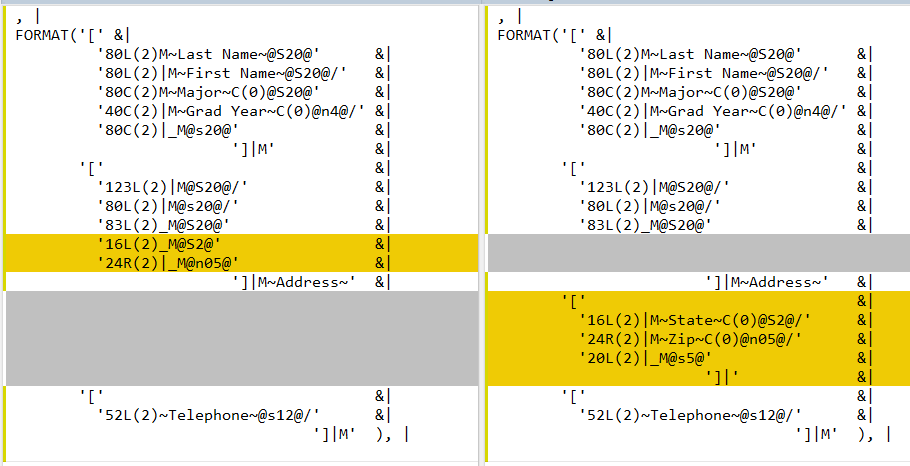

Comparing the Explain Tab that also includes the #Fields() makes it clear State and Zip were moved out of one group and into another.

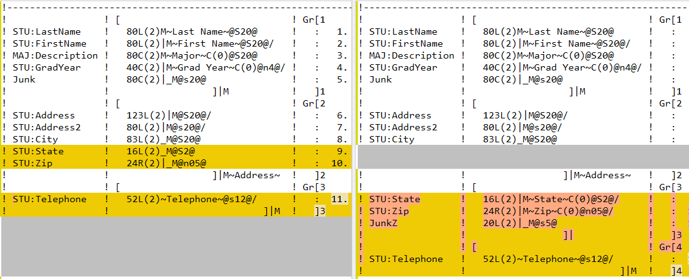
