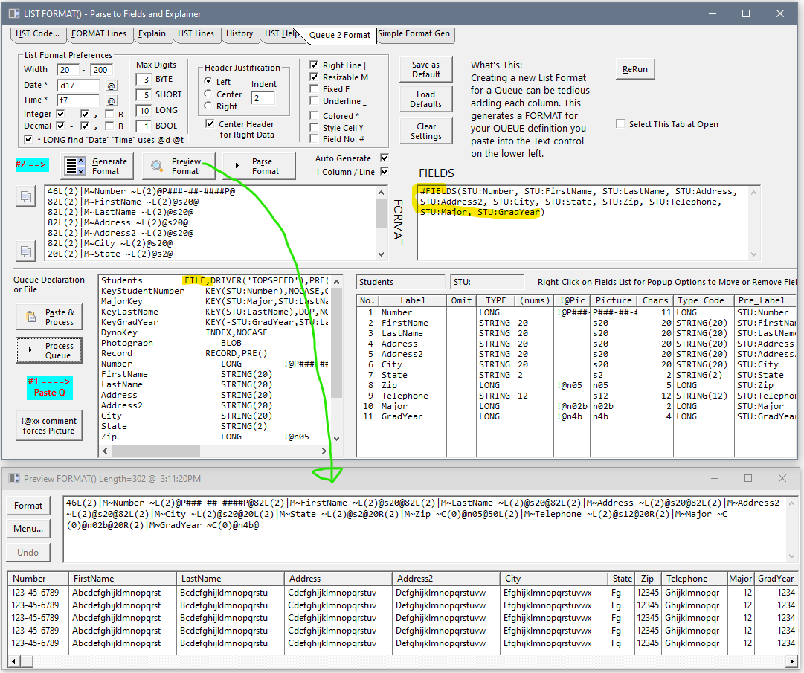

## List-Format-Parser

Discuss this tool on ClarionHub: https://clarionhub.com/t/list-format-parser-split-columns-into-lines-for-view-edit-compare-also-list-previewer/3991?u=carlbarnes

View the LIST's Format() string split into one line per column. Explain and Help on Modifier letters. Useful for ...

* Under Source Control it is easier to understand changes to the LIST by viewing FORMAT in Lines

* See all columns in rows to view all pictures at once, maybe change all @n9.2 to have "b"

* See all columns in rows to view or change Modifiers e.g. remove * off multiple fields for no Color

* Duplicate columns or entire groups by copying rows of format

* Invalid Format errors easier to solve with the LIST split

Paste your LIST FORMAT including #FIELDS() and press Process:


The Format and Fields are split into lines. This makes it easy to read and see columns are consistent. You can paste this into a compare tool. The parsed Format is designed to paste back into your Window... editor to allow modifications.


The Explain tab tries to make the Format easier to understand


The History shows all the LISTs processed since the program opened. You can go back to any prior LIST.


The LIST Help tab documents Modifiers and other Properties.


### Preview List

From the "Format Lines" tab you can click the "Preview Format" button to open a Window showing a LIST with that Format().
 Sample data lines are generated showing the maximum numbers that will fit.
 Cells with Color show in Red. Cells with Style show in Green. Icons and Trees show.


The "Format" button opens my Window Preview Class LIST view to see the Format as shown below.
 You can view all the PROPLIST's for a Column. You can Re-Format the list to view different settings.


Double clicking on a row 2 in the above list shows the "Column LISTPROP" tab displaying each LISTPROP for Column 2 e.g. Header is "Seq.". The Mod column shows the Modifier used in the FORMAT string e.g. Header is ~~ where ~Seq.~ is in the Format. Notice that Column 2 is FieldNo 6 which is because Column 1 is has *Colors which require 4 LOQGs in the Queue.


### Window ... Editor

I often paste the Format into the Window... Editor and make my changes there much faster than via the List Designer. I also can go fast and not freeze the IDE.
 In this example I wanted to make sure all pictures had commas and were large enough for -999,999.99.


### Comparison

In Source control comparing a LIST,FORMAT() and #FIELDS() as a multiline block can make it impossible to see the changes. This picture has what are normally left and right stacked viewing the LIST control.


Below shows comparing the Format split into lines and it becomes more clear two columns titled State and Zip were added, plus a new [ Group ].


Comparing the Explain Tab that also includes the #Fields() makes it clear State and Zip were moved out of one group and into another.


### FORMAT() String Generation from Queue or File -- New October 2021

A LIST FORMAT string can be a tedious thing to make using the IDE List Box Foratter. Each Column requires filling in several entires, check boxes, drop lists, etc on the Property sheet. The new "Queue 2 Format" tab lets you paste in a Queue or File and then build you a pretty good Format string. It also builds a #FIELDS() list for use in the Browse Template. You can Preview the LIST to see how the Format looks.

At the top of the tab List Format Preferences lets you customize many things. On each Field you can append a !@ comment to override the picture. You can also add !Omit to leave out a Field or !Hide to give it zero width. Right-Click on the Fields List on the lower-right for more options e.g. moving fields in the list.


Paste in a FILE structure and the FORMAT() and #FIELDS() are made for the Browse Template.



### FROM() String Parsing -- New November 2021

On the first tab paste your LIST with a ```FROM('Choice One|#1|Choice Two|#2')```. You may also just paste the FROM() without a LIST, or paste a SPIN with a FROM().


Click "Process LIST" to parse and display on the new FROM tab.
The "FROM() Lines" text control on the lower left has the FROM split and reformatted into one item per line with the |#Value (if present) on the same line.  This is formatted to be pasted back into the Window... Editor. When you need to edit the FROM it is easier when split to move lines, delete lines, edit text or add |#Values. It's also easier to read.

On the lower right a ```CASE``` statement is generated with each ```OF 'Value'``` and a comment showing the number and full item text. Below that are two comma delimited lists with each Label or Value which could be used with ```INLIST() or CHOOSE()```.


